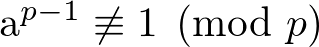

# 確認問題
## 数値
1. 変数 n に 7 を代入しましょう
2. 変数 n を 2 で割ってみましょう
3. 変数 n を 2 で割って小数点以下切り捨ててみましょう
4. 変数 n の剰余 (割ったあまり) を求めてみましょう
5. 変数 n の 2 乗 (n^2) を求めてみましょう
6. [応用] フェルマーテスト (Fermat primality test) を使って素数ではないことを確認してみましょう
  * a と p は互いに素で以下の式を満たす場合、p は合成数である
  
  * 例 1: a: 17, p: 49 => 22: 素数でない
  * 例 2: a: 17, p: 47 => 1: 素数の可能性がある

### 数値 回答
```python
# 1.
>>> n = 7
# 2.
>>> n / 2
3.5
# 3.
>>> n // 2
3
# 4.
>>> n % 2
1
# 5.
>>> n ** 2
49
# 6. 例 1
>>> a = 17
>>> p = 49
>>> a ** (p-1) % p
22  # 1 でないので合成数 (49 = 7 * 7)
# 6. 例 2
>>> a = 17
>>> p = 47
>>> a ** (p-1) % p
1  # 素数の可能性がある (確率的素数) 
```

## 文字列
1. 変数 s に 'Hello\nWorld!' と代入しましょう
2. 変数 s を print() 関数を使って表示してみましょう
3. 変数 s の長さを求めてみましょう
4. [応用] 変数 s の変数 n 番目のインデックスにある文字を表示してみましょう
  * 変数 n は 0 以上 12 未満の整数とします

### 文字列 回答
```python
# 1.
>>> s = 'Hello\nWorld!'
# 1. 別回
>>> s = '''Hello
... World!'''
# 2.
>>> print(s)
Hello
World!
# 3.
>>> len(s)
12  # '\n' は表示上 2 文字に見えますが、これで 1 文字です
# 4. (n が 7 の場合)
>>> n = 6
>>> s[n]
'W'
```

## リスト
1. 変数 l に 空リスト `[]` を代入しましょう
2. append() メソッドを使用して、6, 1, 2 の順に追加してみましょう
3. 変数 l の要素数を求めてみましょう
4. 変数 l の合計を求めてみましょう
5. [応用] 変数 l の平均を求めてみましょう

### リスト 回答
```python
# 1.
>>> l = []
# 2.
>>> l.append(6)
>>> l.append(2)
>>> l.append(1)
>>> l
[6, 2, 1]
# 3.
>>> len(l)
3
# 4.
>>> sum(l)
9
# 5.
>>> sum(l) / len(l)
3
```

## タプル
1. 変数 t に 2 つの値を持つのタプルを代入してみましょう
2. 変数 t の値を 2 つの変数 a, b に一度に代入してみましょう
3. 変数 t に 1 要素のタプルを代入してみましょう

### タプル 回答
```python
# 1. (値は数値でも文字列でも可)
>>> t = (2, 3)
# 2.
>>> a, b = t
>>> a
2
>>> b
3
# 3. カンマ 「,」が必要なので注意
>>> t = (6, )
```

## 辞書
1. 変数 d に a: apple, b: banana, c: cherry (key: value の表記) の辞書を代入してみましょう
2. 変数 d に対して key 'b' を使って value を取得してみましょう
3. 変数 d に対して get() メソッドを使って key 'b' に対する value を取得してみましょう
4. 変数 d に key d が含まれないことを確認してみましょう
5. 変数 d に value durian が含まれないことを確認してみましょう
6. 変数 d に d: durian を追加してみましょう
7. 4., 5. をもう一度確認し、d: durian が含まれることを確認してみましょう
8. 変数 d に対して、get() メソッドで取得しようとした際に、value が見つからない場合に `'not found'` を取得できるようにしてみましょう

### 辞書 回答
```python
# 1. 
>>> d = {'a': 'apple', 'b': 'banana', 'c': 'cherry'}
# 2.
>>> d['b']
'banana'
# 3.
>>> d.get('b')
'banana'
# 4.
>>> 'd' in d
False
>>> 'd' in d.keys()  # こちらでも良い
False
# 5.
>>> 'durian' in d.values()
False
# 6.
>>> d['d'] = 'durian'
# 7.
>>> 'd' in d
True
>>> 'durian' in d.values()
True
# 8.
>>> d.get('e', 'not found')
```
