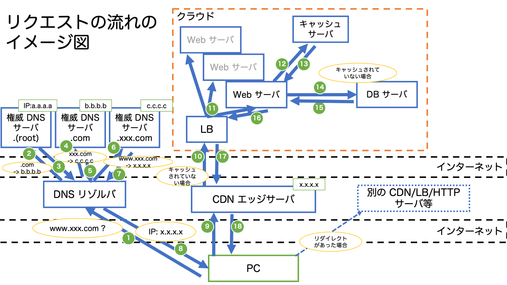

# Web アプリケーションについて
Web アプリについて概要を紹介します。聞き流す感じで大丈夫です。

## Web アプリの特徴
* Web アプリは、主にサーバと HTTP で通信してブラウザ上で操作するアプリケーション
  * 例: https://www.amazon.co.jp/ 等
  * HTTP (HyperText Transfer Protocol):
    * HTML 等を転送することを目的とした規格であり、ブラウザとサーバ間の通信等で使用される
* ネイティブアプリと異なり、クライアント側にアプリケーションのインストールが不要であり、OS 等が異なっていてもブラウザがあれば環境に依存しない (クロスプラットフォームに対応可能)
  * ネイティブアプリ:
    * Windows、MacOS、iOS、Android 上にインストールして使用するアプリケーション
    * 開発する場合は、OS や OS のバージョンごとに作成する必要がある (OS によって開発言語も異なる場合が多い)
      * Windows: C# 等
      * MacOS/iOS: Swift 等
      * Android: Java、Kotlin 等
* サーバ上のファイルを更新するだけで、更新が完了する
  * ネイティブアプリの場合、すべてのユーザーが更新版をインストールするまで更新が完了しない (移行期間を設けて、旧バージョンでのアクセスを維持する必要がある)
* Web アプリのデメリットとしては、動作が遅い
  * インターネットでリソースを取得する時間であったり、JavaScript の実行速度自体が遅い (実行速度については WebAssembly という言語により今後改善する可能性がある)

## Web アプリの構成要素
* Web アプリは、フロントエンドとバックエンドに大きく分類される
```
[フロントエンド] <= インターネット => [バックエンド]
```
* フロントエンド:
  * ブラウザ等のクライアント側
  * 一般的な Web ユーザーが使うインターネットに接続された端末や、端末上で利用できる Web にアクセスするソフトウェアのことを Client と呼びます。
* バックエンド:
  * サーバ側
  * サーバは、Web ページや、サイト、アプリケーションを格納しているコンピュータのことです。
  * クライアントからサーバへアクセスすると、サーバから Web ページのコピー (HTML) がダウンロードされて、ブラウザ上で Web ページが表示されます。

### フロントエンドの構成要素
* Web ブラウザ:
  * Chrome, Firefox, Safari 等のこと
  * サーバからダウンロードした (HTTP レスポンスとして受け取った) HTML を表示します。
* HTML (HyperText Markup Language):
  * Web ページのコンテンツの構造を作るために使うコードです。(HTML はプログラミング言語に含むかは諸説あります。)
  * 開始タグ `<tag>` と終了タグ `</tag>` で挟んで、Web ページの要素を定義します。
  * 詳細は、[こちらのチュートリアル](https://developer.mozilla.org/ja/docs/Learn/HTML) を確認するのが良いかもしれません。
* JavaScript (js と略すこともあります):
  * 名前に Java と入っていますが、Java とは全く異なる言語です。(よく例え話として、インドとインドネシアくらい違う (つまり、全く別物である) と言われています。)
  * 動的に表示内容を変更する (例: ボタンをクリックした場合に、表示を変える等) ために使います。(Web ページで何か表示が変わったら、ほとんどの場合 js によるものです。)
  * `<script>` タグ内に記述するか、`<script>` タグの `src` 属性に JavaScript ファイルの URL を設定することで実行されます。
  * クライアントサイドレンダリングという、サーバから JSON 等の形式でデータを取得し、クライアント側で JavaScript で表示を作る方法もあります。
    * クライアントサイドレンダリングは、1 ページに複数の機能があるような場合や、ユーザー体験 (User Experience; UX) を上げるためにページ遷移なしで表示したい場合等で使われます。
  * 詳細は、[こちらのチュートリアル](https://developer.mozilla.org/ja/docs/Learn/JavaScript/First_steps/What_is_JavaScript) を確認するのが良いかもしれません。
* CSS (Cascading Style Sheets):
  * Web ページのデザインを設定するために使われます。
  * `<style>` タグ内に記述するか、各タグ内の `style` 属性に記述するか、`<link>` タグの `href` 属性に CSS ファイルの URL を設定することで、HTML に対してスタイルを適用することができます。
  * JavaScript を利用して、動的に CSS を適用することも可能です。
  * 詳細は、[こちらのチュートリアル](https://developer.mozilla.org/ja/docs/Learn/CSS/First_steps) を確認するのが良いかもしれません。

### バックエンドの構成要素
* サーバ: 役割やサーバ上のアプリケーションによって異なる動作・呼び方をします。
  * HTTP サーバ / Web サーバ
    * アプリケーションサーバやロードバランサーを含んでいる場合もある
    * Nginx/Apache (httpd) 等が有名
  * アプリケーションサーバ (AP サーバ)
    * Python 等のプログラミング言語で記述された、動的なコンテンツの生成を行うサーバ
    * Python の場合、WSGI (Web Server Gateway Interface) という HTTP サーバとアプリケーションを接続するための機能を提供するソフトウェアとセットで使用される (uwsgi, mod_wsgi (Apache), gunicorn, fastcgi 等が有名)
  * ロードバランサー (LoadBalancer; LB)
    * ロードバランサーが受けたリクエストを、背後にある複数のサーバのいずれかに割り振る
    * 負荷を分散したり、可用性 (背後のサーバで障害が発生してもシステム全体として正常に稼働できる) を高めるために使用される
    * Nginx/Apache (httpd) の機能で実現可能
  * データベースサーバ (DB サーバ)
    * データを保存しているサーバ
    * SQL という言語で、DB サーバに問い合わせることで、欲しい情報を取得することができる
    * DB サーバを冗長化することもある
    * リレーショナルデータベース (RDB): MySQL/PostgreSQL, NoSQL: MongoDB 等が有名
  * キャッシュサーバ
    * DB への問い合わせる頻度の高いもの等をキャッシュ (一時保存) して、DB への問い合わせの頻度を低下することで、システム全体での応答速度を高速化する
    * DB がディスクに保存するのに対して、高速に読み書き可能なメモリに保存することで、高速に取得が可能
    * RDB に比べ複雑な問い合わができず (基本的に Key-Value 型)、複雑な構造のデータを保存できない
    * メモリに保存する性質から揮発性 (電源を供給しないと記憶しているデータを保持できない) があるため、長期保存に向かない
    * Redis/Memcached が有名
  * DNS サーバ
    * ドメイン名 (例: amazon.com) から IP アドレスを解決する
    * 主に 2 種類のサーバがあり、レコード (ドメイン名と IP アドレスの情報を紐付けるデータ) を保持する 権威 DNS サーバ(Authoritative Name Server) と、権威 DNS サーバへ繰り返し問い合わせてドメイン名から IP アドレスを解決する DNS Resolver (DNS キャッシュサーバとも呼ばれる) がある
    * BIND 等が有名
  * CDN (Content Delivery Network):
    * DNS の仕組みを活用して、送信元 IP アドレスに最も近いキャッシュサーバ (エッジサーバとも呼びます) の IP アドレスを返却する
    * オリジンサーバ (アクセスしたいサーバ) の代理で応答し、キャッシュサーバがキャッシュしていなければ、オリジンサーバへリクエストし、オリジンサーバからのレスポンスをキャッシュして、クライアントへ応答する。以降はキャッシュサーバが保持しているキャッシュを返却する。
    * キャッシュ (システムのパフォーマンス向上)、オリジンサーバの負荷分散として利用する
    * Fastly, CloudFront (AWS), Akamai CDN 等のサービスを利用する
* リクエストの流れ


```
1. DNS 名 (例: www.xxx.com) -> IP アドレス (X.X.X.X) を取得
[クライアント] => [DNS Resolver/キャッシュサーバ] => [DNS 権威サーバ]
2. IP アドレス (X.X.X.X) のサーバへ HTTP リクエストを送る
[クライアント] => [CDN エッジサーバ] => [LB] => [HTTP サーバ] => [AP サーバ] => [DB サーバ]
                                                            [AP サーバ] => [キャッシュサーバ]
  * CDN にキャッシュされている場合、CDN から即返却
  * キャッシュされていない場合、背後のサーバへリクエストを送信
  * CSS や JS、静的な HTML 等は、HTTP サーバからリクエストの逆順に辿ってクライアントへ返却
    * 外部のサーバが CSS 等のファイルを保持している場合は、外部サーバへアクセスするように指示をする (リダイレクトのレスポンスを返却する)
  * 動的なページはアプリケーションサーバが必要に応じて、キャッシュサーバや DB サーバ等へアクセスして、データを加工して HTML 等にして、リクエストの逆順に辿ってクライアントへ返却
3. サーバから HTTP レスポンスを受け取って表示する (リダイレクトレスポンスを受け取った場合は、クライアントは指定されたサーバへ HTTP リクエストを送る)
```
