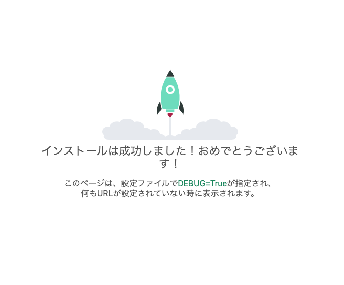

# プロジェクトの設定
## tutorial/settings.py の修正
```python
INSTALLED_APPS = [
    'tutorial',  # 追加
    'tutorial.todo',  # 追加
    'tutorial.site_admin',  # 追加
    'django.contrib.admin',
```

```python
LANGUAGE_CODE = 'ja'  # 'en-us' から変更

TIME_ZONE = 'Asia/Tokyo'  # 'UTC' から変更
```

### 追加
(後で設定するものですが、まとめて設定しておきます)
```python
# Login/Logout
LOGIN_URL = '/login/'
LOGIN_REDIRECT_URL = '/'
LOGOUT_URL = '/logout/'

# Messages
from django.contrib.messages import constants as messages
MESSAGE_TAGS = {
    messages.SUCCESS: 'alert alert-success',
    messages.INFO: 'alert alert-info',
    messages.ERROR: 'alert alert-danger',
    messages.WARNING: 'alert alert-warning',
}
```

## tutorial/todo/apps.py の修正
```python
class TodoConfig(AppConfig):
    default_auto_field = 'django.db.models.BigAutoField'
    name = 'tutorial.todo'  # todo から変更
```

## tutorial/site_admon/apps.py の修正
```python
class SiteAdminConfig(AppConfig):
    default_auto_field = 'django.db.models.BigAutoField'
    name = 'tutorial.site_admin'  # site_admin から変更
```


# デバッグサーバの起動
```bash
$ cd src
$ python manage.py runserver
...
Django version 4.2.6, using settings 'tutorial.settings'
Starting development server at http://127.0.0.1:8000/
Quit the server with CONTROL-C.
```

デバッグサーバが起動したら、[http://127.0.0.1:8000/](http://127.0.0.1:8000/) もしくは [http://localhost:8000/](http://localhost:8000/) へアクセスすることで、サイトにアクセス可能。



上記の画面が表示されていれば成功。
