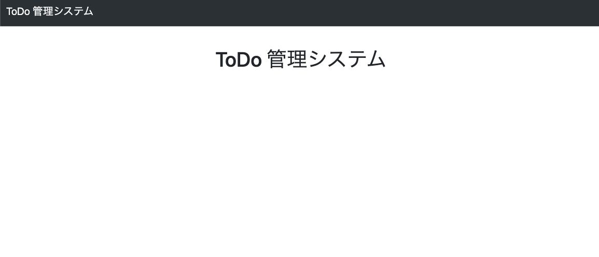

# urls.py の作成とトップページの作成
## tutorial/urls.py の修正
以下に変更
```python
from django.contrib import admin
from django.urls import include, path

urlpatterns = [
    path("todo/", include(("tutorial.todo.urls", "todo"), namespace="todo")),
    path("admin/", include(("tutorial.site_admin.urls", "site_admin"), namespace="site_admin")),
    path("admin/native/", admin.site.urls),
]
```

## tutorial/todo/urls.py の作成
```python
urlpatterns = [
]
```

## tutorial/site_admin/urls.py の作成
```python
urlpatterns = [
]
```

# トップページの作成
* [Bootstrap](https://getbootstrap.jp/docs/5.3/getting-started/introduction/) を使用したページを作成する。
* Web ページを動的に制御するために [jQuery](https://jquery.com/) という JavaScript ライブラリも追加しておく。

```bash
$ mkdir tutorial/templates
```

## ベースのテンプレート (tutorial/templates/base.html) を作成
```html


<!doctype html>
<html lang="ja">
  <head>
    <meta charset="utf-8">
    <meta name="viewport" content="width=device-width, initial-scale=1">
    <title>ToDo 管理システム</title>
    <link href="https://cdn.jsdelivr.net/npm/bootstrap@5.3.0/dist/css/bootstrap.min.css" rel="stylesheet" integrity="sha384-9ndCyUaIbzAi2FUVXJi0CjmCapSmO7SnpJef0486qhLnuZ2cdeRhO02iuK6FUUVM" crossorigin="anonymous">
    <script src="https://cdn.jsdelivr.net/npm/bootstrap@5.3.0/dist/js/bootstrap.bundle.min.js" integrity="sha384-geWF76RCwLtnZ8qwWowPQNguL3RmwHVBC9FhGdlKrxdiJJigb/j/68SIy3Te4Bkz" crossorigin="anonymous"></script>
    <script src="https://ajax.googleapis.com/ajax/libs/jquery/3.7.1/jquery.min.js"></script>
    <style type="text/css">
      #main {
        padding: 40px 15px;
      }
      .align-center {
        text-align: center;
      }
      .checkbox li {
        list-style-type: none;
      }
      .checkbox ul {
        padding-left: 10px;
      }
      .asteriskField {
        color: red;
      }
    </style>
    
      {{ form.media }}
    
    
    
    
  </head>
  <body>
    
      <nav class="navbar navbar-expand-lg bg-body-tertiary bg-dark border-bottom border-bottom-dark" data-bs-theme="dark">
        <div class="container-fluid">
          
          <a class="navbar-brand" href="">ToDo 管理システム</a>
          
          <button class="navbar-toggler" type="button" data-bs-toggle="collapse" data-bs-target="#navbar" aria-controls="navbarNavDropdown" aria-expanded="false" aria-label="Toggle navigation">
            <span class="navbar-toggler-icon"></span>
          </button>
          <div class="collapse navbar-collapse" id="navbar">
            <ul class="navbar-nav">
              
              
            </ul>
            <ul class="navbar-nav ms-auto">
              
              
            </ul>
          </div>
        </div>
      </nav>
    
    <div class="container">
      
      
      
        
          
          <div class="alert {{ message.tags }}">{{ message }}</div>
          
        
      
      <div id="main">
        
        
      </div>
  </body>
</html>
```

## トップページのテンプレート (tutorial/templates/index.html) を作成
```html



<div class="align-center">
  <h1>ToDo 管理システム</h1>
</div>

```

### tutorial/urls.py の修正
```python
from django.contrib import admin
from django.urls import include, path
from django.shortcuts import render  # 追加

urlpatterns = [
    path("", lambda request: render(request, "index.html"), name="index"),  # 追加
    path("todo/", include(("tutorial.todo.urls", "todo"), namespace="todo")),
    path("admin/", include(("tutorial.site_admin.urls", "site_admin"), namespace="site_admin")),
    path("admin/native/", admin.site.urls),
]
```

`python manage.py runserver` してトップページが表示されていれば成功。


