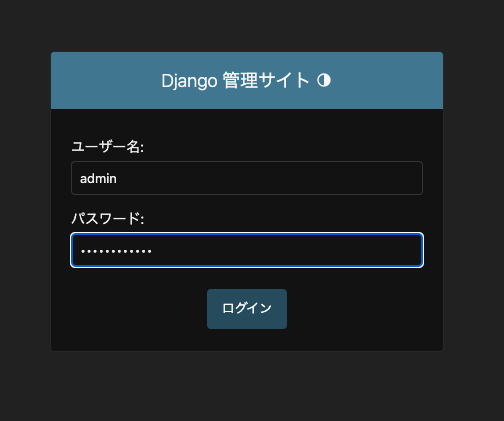
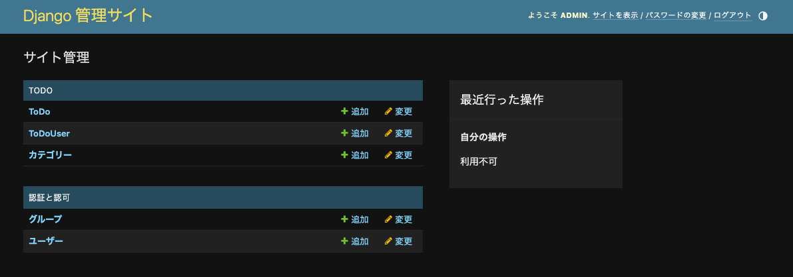

# Models の定義
### ベースモデル (tutorial/models.py) 作成
```python
from django.db import models


class ModelBase(models.Model):

    class Meta:
        abstract = True
        ordering = ["-created"]

    created = models.DateTimeField("作成日時", auto_now_add=True)
    updated = models.DateTimeField("更新日時", auto_now=True)
    enabled = models.BooleanField("有効", default=True)
```


### tutorial/todo/models.py 作成
```python
from django.db import models
from django.contrib.auth.models import User
from django.utils import timezone
from tutorial.models import ModelBase


class Category(ModelBase):
    """カテゴリー"""

    class Meta:
        verbose_name = verbose_name_plural = "カテゴリー"
        ordering = ["order"]

    name = models.CharField("名称", max_length=255)
    order = models.PositiveIntegerField("表示順")

    def __str__(self):
        return self.name


class ToDoUser(User):
    """ユーザー"""

    class Meta:
        verbose_name = verbose_name_plural = "ToDoUser"
        ordering = ["-date_joined"]

    handle_name = models.CharField("表示名", max_length=255)

    def __str__(self):
        return self.handle_name


class ToDo(ModelBase):
    """ToDo"""

    class Meta:
        verbose_name = verbose_name_plural = "ToDo"

    user = models.ForeignKey(
        ToDoUser, verbose_name="ユーザー", on_delete=models.PROTECT)
    categories = models.ManyToManyField(Category, verbose_name="カテゴリー")

    name = models.CharField("名称", max_length=255)
    deadline = models.DateTimeField("締め切り")
    completed = models.DateTimeField("完了日時", null=True, blank=True)

    PRIORITY_HIGH = 1
    PRIORITY_MIDDLE = 2
    PRIORITY_LOW = 3
    PRIORITY_CHOICES = (
        (PRIORITY_HIGH, "高"),
        (PRIORITY_MIDDLE, "中"),
        (PRIORITY_LOW, "低"),
    )
    priority = models.PositiveIntegerField("優先度", choices=PRIORITY_CHOICES)
    note = models.TextField("備考", blank=True)

    def __str__(self):
        return self.name

    @property
    def is_completed(self):
        return self.completed is not None

    def complete(self):
        self.completed = timezone.now()
        self.save()
```


### Django 管理者画面用の追加設定 (tutorial/todo/admin.py)
```python
from django.contrib import admin
from .models import Category, ToDoUser, ToDo

admin.site.register(Category)
admin.site.register(ToDoUser)
admin.site.register(ToDo)
```

## Migration (Models の情報を DB に反映)
```bash
$ python manage.py makemigrations  # 既存の状態との差分を検出
Migrations for 'todo':
  tutorial/todo/migrations/0001_initial.py
    - Create model Category
    - Create model ToDoUser
    - Create model ToDo
$ python manage.py migrate  # 差分を DB に反映
Operations to perform:
  Apply all migrations: admin, auth, contenttypes, sessions, todo
Running migrations:
  Applying contenttypes.0001_initial... OK
  Applying auth.0001_initial... OK
  Applying admin.0001_initial... OK
  Applying admin.0002_logentry_remove_auto_add... OK
  Applying admin.0003_logentry_add_action_flag_choices... OK
  Applying contenttypes.0002_remove_content_type_name... OK
  Applying auth.0002_alter_permission_name_max_length... OK
  Applying auth.0003_alter_user_email_max_length... OK
  Applying auth.0004_alter_user_username_opts... OK
  Applying auth.0005_alter_user_last_login_null... OK
  Applying auth.0006_require_contenttypes_0002... OK
  Applying auth.0007_alter_validators_add_error_messages... OK
  Applying auth.0008_alter_user_username_max_length... OK
  Applying auth.0009_alter_user_last_name_max_length... OK
  Applying auth.0010_alter_group_name_max_length... OK
  Applying auth.0011_update_proxy_permissions... OK
  Applying auth.0012_alter_user_first_name_max_length... OK
  Applying sessions.0001_initial... OK
  Applying todo.0001_initial... OK
```

## 管理者の登録
```bash
$ python manage.py createsuperuser
ユーザー名 (leave blank to use 'okawart'): admin
メールアドレス:  # 何も入力しなくて OK
Password:  # admin ユーザーのパスワードを入力
Password (again):  # 同じものを再度入力
Superuser created successfully.
```

[http://127.0.0.1:8000/admin/native/](http://127.0.0.1:8000/admin/native/) にアクセスして、上記のユーザー名、パスワードでログインできれば OK。

#### ログインページ



#### ログイン完了後 (Django 管理サイト)


