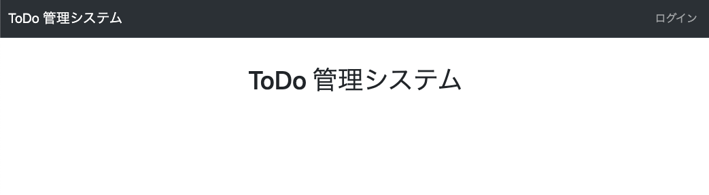
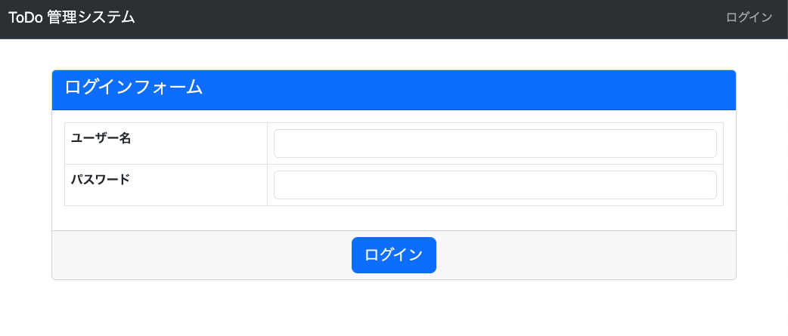
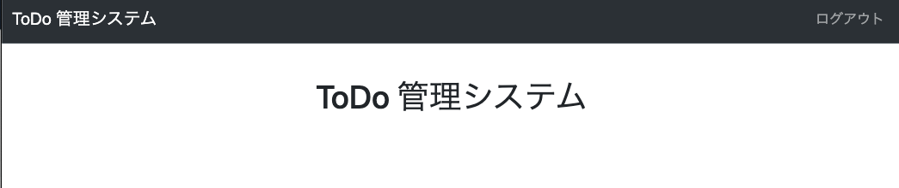

# Login/Logout
* Django で用意されている [LoginView](https://docs.djangoproject.com/en/4.2/topics/auth/default/#django.contrib.auth.views.LoginView), [LogoutView](https://docs.djangoproject.com/en/4.2/topics/auth/default/#django.contrib.auth.views.LogoutView) を使用してログイン/ログアウト機能を実装。
* やること
  1. urls にログイン/ログアウトの view を追加
  2. login.html を作成
  3. base.html の navbar にリンクを追加

### tutorial/urls.py 変更
```python
from django.contrib import admin
from django.urls import include, path
from django.shortcuts import render
from django.contrib.auth.views import LoginView, LogoutView  # 追加

urlpatterns = [
    path("", lambda request: render(request, "index.html"), name="index"),
    path("todo/", include(("tutorial.todo.urls", "todo"), namespace="todo")),
    path("admin/", include(("tutorial.site_admin.urls", "site_admin"), namespace="site_admin")),
    path("admin/native/", admin.site.urls),
    path("login/", LoginView.as_view(template_name="login.html"), name="login"),  # 追加
    path("logout/", LogoutView.as_view(next_page="index"), name="logout"),  # 追加
]
```

### tutorial/templates/login.html 作成
```html


ログイン


<script type="text/javascript">
  $(function(){
    $("#id_username").addClass("form-control");
    $("#id_password").addClass("form-control");
  });
</script>



<form method="post">
  <div class="card">
    <div class="card-header text-bg-primary">
      <h4 class="card-title">ログインフォーム</h4>
    </div>
    <div class="card-body">
      <table class="table table-bordered">
        <tbody class="">
          <tr><th colspan="2" class="table-danger">ユーザー名とパスワードが一致しませんでした。</th></tr>
          <tr class="table-danger">
            <th>{{ form.username.label }}</th>
            <td>{{ form.username.errors }}{{ form.username }}</td>
          </tr>
          <tr class="table-danger">
            <th>{{ form.password.label }}</th>
            <td>{{ form.password.errors }}{{ form.password }}</td>
          </tr>
        </tbody>
      </table>
    </div>
    <div class="card-footer align-center">
      <input class="btn btn-primary btn-lg" type="submit" value="ログイン" />
      <input type="hidden" name="next" value="{{ next }}" />
    </div>
  </div>
</form>

```

### tutorial/templates/base.html 変更
```html
              
                 <!-- この行から追加 -->
                  <li class="nav-item"><a class="nav-link" href="">ログアウト</a></li>
                
                  <li class="nav-item"><a class="nav-link" href="">ログイン</a></li>
                 <!-- 追加ここまで -->
              
```


### 確認
[http://127.0.0.1:8000/](http://127.0.0.1:8000/) にアクセスして、以下となっていれば OK。

#### トップページ (非ログイン時/ログアウト後)



#### ログインページ



#### トップページ (ログイン後)


