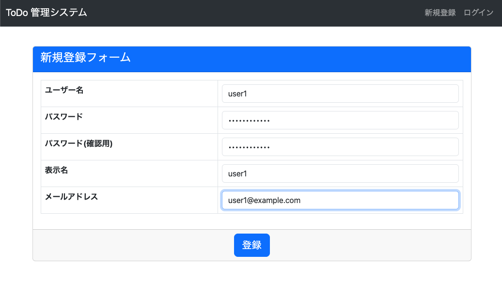
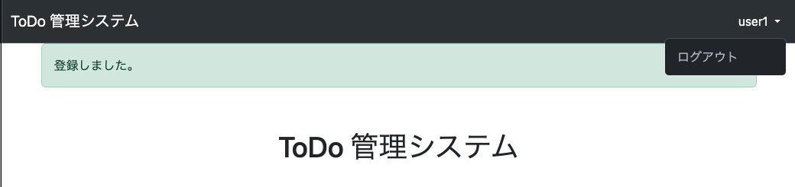

# ToDoUser 登録
* やること
  * 作成
    1. tutorial/forms.py に画面表示を調整するための共通処理を作成
    2. tutorial/todo/forms.py に ToDoUser の登録で必要なデータの受け渡しするフォームの作成
    3. tutorial/todo/views.py に ToDoUser 登録機能を作成
    4. tutorial/todo/templates/todo/user_create.html にユーザー登録画面を作成
  * 変更
    5. tutorial/todo/urls.py に view を追加
    6. tutorial/templates/base.html にリンクを追加 (ログイン時の表示を修正)

### tutorial/forms.py 作成
```python
from django import forms


class FormControlMixin(forms.BaseForm):

    def __init__(self, *args, **kwargs):
        super().__init__(*args, **kwargs)
        for field in self.fields:
            if not isinstance(self.fields[field].widget, (
                    forms.CheckboxInput, forms.RadioSelect)):
                self.fields[field].widget.attrs.update(
                    {'class': "form-control"})
```

### tutorial/todo/forms.py 作成
```python
from django import forms
from django.contrib.auth import authenticate, login
from django.contrib.auth.forms import UserCreationForm

from tutorial.forms import FormControlMixin
from .models import ToDoUser


class ToDoUserCreateForm(UserCreationForm, FormControlMixin):
    email = forms.EmailField(label="メールアドレス", required=True)
    username = forms.RegexField(
        label="ユーザー名",
        max_length=15,
        regex=r'^[a-zA-Z0-9]+$',
        error_messages={'invalid': "半角英数15字以内で入力してください。"})

    class Meta:
        model = ToDoUser
        fields = [
            "username",
            "password1",
            "password2",
            "handle_name",
            "email",
        ]

    def __init__(self, *args, **kwargs):
        self.request = kwargs.pop("request")
        super().__init__(*args, **kwargs)

    def save(self, commit=True):
        todouser = super().save(commit)
        if commit:
            # 登録と同時にログインさせる
            user = authenticate(
                username=self.cleaned_data["username"],
                password=self.cleaned_data["password1"])
            if user is not None and user.is_active:
                login(self.request, user)
        return todouser
```

### tutorial/todo/views.py 作成
```python
from django.views.generic import CreateView
from django.contrib.messages.views import SuccessMessageMixin
from django.urls import reverse_lazy

from .models import ToDoUser
from .forms import ToDoUserCreateForm


class ToDoUserCreateView(SuccessMessageMixin, CreateView):
    model = ToDoUser
    form_class = ToDoUserCreateForm
    success_url = reverse_lazy('index')
    template_name = "todo/user_create.html"
    success_message = "登録しました。"

    def get_form_kwargs(self):
        kwargs = super().get_form_kwargs()
        kwargs.update({"request": self.request})
        return kwargs
```

### tutorial/todo/templates/todo/user_create.html 作成
```html

新規登録


<form method="post">
  <div class="card">
    <div class="card-header text-bg-primary">
      <h4 class="card-title">新規登録フォーム</h4>
    </div>
    <div class="card-body">
      <table class="table table-bordered">
        
          <tr class="table-danger">
            <th>{{ field.label }}</th>
            <td>{{ field.errors }}{{ field }}</td>
          </tr>
        
      </table>
    </div>
    <div class="card-footer align-center">
      <button type="submit" class="btn btn-lg btn-primary">登録</button>
    </div>
  </div>
</form>

```

### tutorial/todo/urls.py 変更
以下のように変更

```python
from django.urls import path
from .views import ToDoUserCreateView

urlpatterns = [
    path("user/create/", ToDoUserCreateView.as_view(), name="user_create"),
]
```

### tutorial/templates/base.html 変更
以下のように変更

```html
              
                
                   <li class="nav-item dropdown">
                      <a class="nav-link dropdown-toggle" href="#" id="navbarDropdown" role="button" data-bs-toggle="dropdown" aria-expanded="false">
                        {{ user.todouser.handle_name }}
                      </a>
                      <ul class="dropdown-menu dropdown-menu-end", aria-labelledby="navbarDropdown">
                        <li><a class="dropdown-item" href="">ログアウト</a></li>
                      </ul>
                   </li>
                
                  <li class="nav-item"><a class="nav-link" href="">新規登録</a></li>
                  <li class="nav-item"><a class="nav-link" href="">ログイン</a></li>
                
              
```

### 確認
[http://127.0.0.1:8000/todo/user/create/](http://127.0.0.1:8000/todo/user/create/) にアクセスして、以下となっていれば OK。

#### ToDoUser 登録画面 (navbar: 非ログイン時)



#### 登録後完了画面 (トップページ) (navbar: ログイン時)



