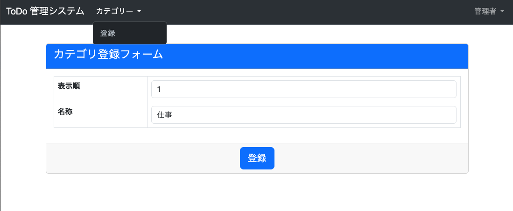
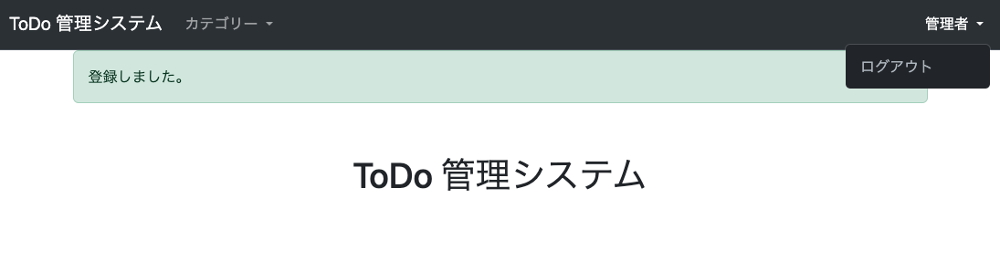

#  管理者機能 Category の登録
* やること
  * 作成
    1. `tutorial/views.py` にユーザーと管理者のログインを要求する共通処理を作成
    2. `tutorial/site_admin/forms.py` に Category 登録用のフォームを作成
    3. `tutorial/site_admin/views.py` に Category 登録機能を作成
    4. `tutorial/site_admin/templates/site_admin/category/create.html` に Category 登録画面作成
      * 共通デザインを再利用可能に
        * `tutorial/templates/include/form.html`作成
        * `tutorial/todo/templates/todo/user_create.html`変更
  * 変更
    5. `tutorial/site_admin/urls.py` に view を追加
    6. `tutorial/templates/base.html` にリンクを追加 (管理者ログイン時の表示を修正)

### tutorial/views.py 作成
```python
from django.contrib.auth.decorators import login_required, user_passes_test
from django.utils.decorators import method_decorator


class LoginRequiredMixin(object):

    @method_decorator(login_required)
    def dispatch(self, *args, **kwargs):
        return super().dispatch(*args, **kwargs)


class AdminLoginRequiredMixin(object):

    @method_decorator(user_passes_test(lambda u: u.is_superuser))
    def dispatch(self, *args, **kwargs):
        return super().dispatch(*args, **kwargs)
```

### tutorial/site_admin/forms.py 作成
```python
from django import forms

from tutorial.forms import FormControlMixin
from tutorial.todo.models import Category


class CategoryCreateForm(forms.ModelForm, FormControlMixin):

    class Meta:
        model = Category
        fields = [
            'order',
            'name',
        ]
```

### tutorial/site_admin/views.py 作成
```python
from django.views.generic import CreateView
from django.contrib.messages.views import SuccessMessageMixin
from django.urls import reverse_lazy

from tutorial.todo.models import Category
from tutorial.views import AdminLoginRequiredMixin
from .forms import CategoryCreateForm


class CategoryCreateView(AdminLoginRequiredMixin, SuccessMessageMixin, CreateView):
    model = Category
    form_class = CategoryCreateForm
    success_url = reverse_lazy('index')
    template_name = "site_admin/category/create.html"
    success_message = "登録しました。"
```

### tutorial/templates/include/form.html 作成
```html
<form method="post">
  <div class="card">
    <div class="card-header text-bg-primary">
      <h4 class="card-title">{{ form_title }}</h4>
    </div>
    <div class="card-body">
      <table class="table table-bordered">
        
          <tr class="table-danger">
            <th>{{ field.label }}</th>
            <td>{{ field.errors }}{{ field }}</td>
          </tr>
        
      </table>
    </div>
    <div class="card-footer align-center">
      <button type="submit" class="btn btn-lg btn-primary">{{ submit_btn_label }}</button>
    </div>
  </div>
</form>
```

### tutorial/site_admin/templates/site_admin/category/create.html 作成
```html

カテゴリ登録




```

### tutorial/todo/templates/todo/user_create.html 変更
```html

新規登録




```

### tutorial/site_admin/urls.py 変更
```python
from django.urls import path
from .views import CategoryCreateView

urlpatterns = [
    path("category/create/", CategoryCreateView.as_view(), name="category_create"),
]
```

### tutorial/templates/base.html 変更
```html
              
                 <!-- ここから -->
                  
                    <li class="nav-item dropdown">
                      <a class="nav-link dropdown-toggle" href="#" id="navbarDropdownCategory" role="button" data-bs-toggle="dropdown" aria-expanded="false">
                        カテゴリー
                      </a>
                      <ul class="dropdown-menu", aria-labelledby="navbarDropdownCategory">
                        <li><a class="dropdown-item" href="">登録</a></li>
                      </ul>
                    </li>
                  
                 <!-- ここまで-->
              
```

```html
              
                
                  <li class="nav-item dropdown">
                    <a class="nav-link dropdown-toggle" href="#" id="navbarDropdown" role="button" data-bs-toggle="dropdown" aria-expanded="false">
                       <!-- ここから -->
                        管理者
                      
                        {{ user.todouser.handle_name }}
                       <!-- ここまで-->
                    </a>
```

### 確認
[http://127.0.0.1:8000/admin/category/create/](http://127.0.0.1:8000/admin/category/create/) にアクセスして、以下となっていれば OK。

#### Category 登録画面 (管理者ログイン後、未ログイン時はログイン画面へ遷移)



#### 登録後完了画面 (トップページ)



