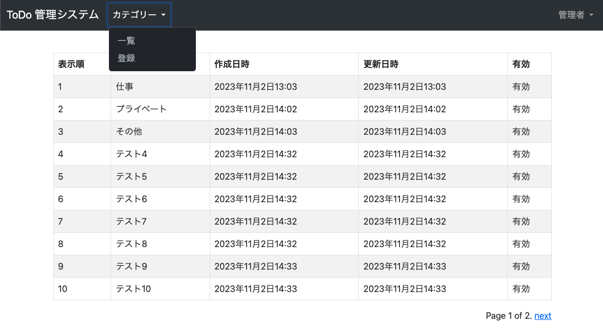

#  管理者機能 Category 一覧
* やること
  1. `tutorial/site_admin/views.py` に Category 一覧機能を作成
  2. `tutorial/site_admin/templates/site_admin/category/list.html` に Category 一覧画面作成
    * tutorial/templates/include/pagination.html ページング部分の共通デザインを再利用可能に
  3. `tutorial/site_admin/urls.py` に view を追加
  4. `tutorial/templates/base.html` にリンクを追加 (管理者ログイン時の表示を修正)


### tutorial/site_admin/views.py 作成
```python
from django.views.generic import CreateView, ListView  # 変更
from django.contrib.messages.views import SuccessMessageMixin
from django.urls import reverse_lazy

from tutorial.todo.models import Category
from tutorial.views import AdminLoginRequiredMixin
from .forms import CategoryCreateForm


class CategoryCreateView(AdminLoginRequiredMixin, SuccessMessageMixin, CreateView):
    model = Category
    form_class = CategoryCreateForm
    success_url = reverse_lazy('site_admin:category_list')  # 変更
    template_name = "site_admin/category/create.html"
    success_message = "登録しました。"


class CategoryListView(AdminLoginRequiredMixin, ListView):  # 以下追加
    model = Category
    template_name = "site_admin/category/list.html"
    context_object_name = "category_list"
    paginate_by = 10
```


### tutorial/templates/include/pagination.html 作成
```html
<div class="pagination" style="float:right">
  <span class="page-links">
    
    <a href="?page={{ page_obj.previous_page_number }}">previous</a>
    
    <span class="page-current">
      Page {{ page_obj.number }} of {{ page_obj.paginator.num_pages }}.
    </span>
    
    <a href="?page={{ page_obj.next_page_number }}">next</a>
    
  </span>
</div>
```

### tutorial/site_admin/templates/site_admin/category/list.html 作成
```html

カテゴリー一覧


<table class="table table-bordered table-striped">
  <thead>
    <tr>
      <th>表示順</th><th>名称</th><th>作成日時</th><th>更新日時</th><th>有効</th>
    </tr>
  </thead>
  <tbody>
    
    <tr>
      <td>{{ category.order }}</td>
      <td>{{ category.name }}</td>
      <td>{{ category.created }}</td>
      <td>{{ category.updated }}</td>
      <td>有効無効</td>
    </tr>
    
  </tbody>
</table>




```

### tutorial/site_admin/urls.py 変更
```python
from django.urls import path
from .views import CategoryCreateView, CategoryListView  # 変更

urlpatterns = [
    path("category/", CategoryListView.as_view(), name="category_list"),  # 追加
    path("category/create/", CategoryCreateView.as_view(), name="category_create"),
]
```

### tutorial/templates/base.html 変更
```html
              
                
                  
                    <li class="nav-item dropdown">
                      <a class="nav-link dropdown-toggle" href="#" id="navbarDropdownCategory" role="button" data-bs-toggle="dropdown" aria-expanded="false">
                        カテゴリー
                      </a>
                      <ul class="dropdown-menu", aria-labelledby="navbarDropdownCategory">
                        <li><a class="dropdown-item" href="">一覧</a></li> <!-- 追加 -->
                        <li><a class="dropdown-item" href="">登録</a></li>
                      </ul>
                    </li>
                  
                
              
```


### 確認
[http://127.0.0.1:8000/admin/category/](http://127.0.0.1:8000/admin/category/) にアクセスして、以下となっていれば OK。

#### Category 一覧画面



