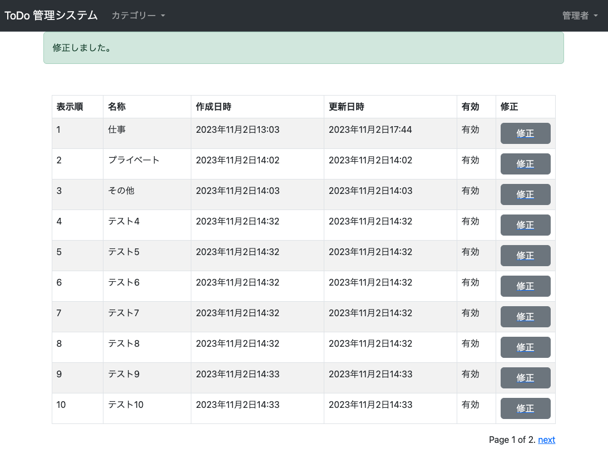

#  管理者機能 Category 修正
* やること
  1. `tutorial/site_admin/forms.py` に Category 修正フォームを追加
  2. `tutorial/site_admin/views.py` に Category 修正機能を追加
  3. `tutorial/site_admin/templates/site_admin/category/edit.html` に Category 修正画面を作成
  4. `tutorial/site_admin/urls.py` に view を追加
  5. `tutorial/site_admin/templates/site_admin/category/list.html` にリンクを追加


### tutorial/site_admin/forms.py 変更
```python
class CategoryEditForm(forms.ModelForm, FormControlMixin):  # 以下追加

    class Meta:
        model = Category
        fields = [
            'enabled',
            'order',
            'name',
        ]
```

### tutorial/site_admin/views.py 変更
```python
from django.views.generic import CreateView, ListView, UpdateView  # 変更
from django.contrib.messages.views import SuccessMessageMixin
from django.urls import reverse_lazy

from tutorial.todo.models import Category
from tutorial.views import AdminLoginRequiredMixin
from .forms import CategoryCreateForm, CategoryEditForm  # 変更

...

class CategoryEditView(AdminLoginRequiredMixin, SuccessMessageMixin, UpdateView):  # 以下追加
    model = Category
    form_class = CategoryEditForm
    success_url = reverse_lazy('site_admin:category_list')
    pk_url_kwarg = 'category_id'
    template_name = "site_admin/category/edit.html"
    success_message = "修正しました。"
```


### tutorial/site_admin/templates/site_admin/category/edit.html 作成
```html

カテゴリ修正




```


### tutorial/site_admin/urls.py 変更
```python
from django.urls import path
from .views import CategoryCreateView, CategoryListView, CategoryEditView  # 変更

urlpatterns = [
    path("category/", CategoryListView.as_view(), name="category_list"),
    path("category/<int:category_id>/", CategoryEditView.as_view(), name="category_edit"),  # 追加
    path("category/create/", CategoryCreateView.as_view(), name="category_create"),
]
```

### tutorial/site_admin/templates/site_admin/category/list.html 変更
```html
  <thead>
    <tr>
      <th>表示順</th><th>名称</th><th>作成日時</th><th>更新日時</th><th>有効</th><th>修正</th>  <!-- 変更 -->
    </tr>
  </thead>
  <tbody>
    
    <tr>
      <td>{{ category.order }}</td>
      <td>{{ category.name }}</td>
      <td>{{ category.created }}</td>
      <td>{{ category.updated }}</td>
      <td>有効無効</td>
      <td> <!-- 追加ここから -->
        <a href="" class="d-grid">
          <button class="btn btn-secondary" type="button">修正</button>
        </a>
      </td> <!-- 追加ここまで -->
    </tr>
```


### 確認
[http://127.0.0.1:8000/admin/category/1/](http://127.0.0.1:8000/admin/category/1/) にアクセスして、以下となっていれば OK。

#### Category 修正画面


#### 修正完了画面 (Category 一覧)



