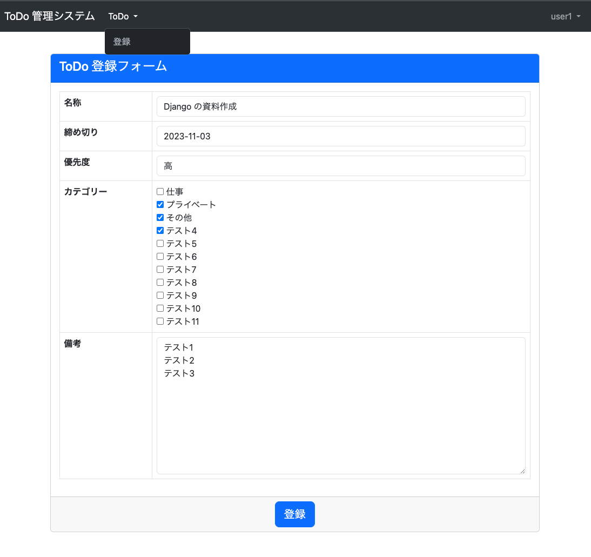
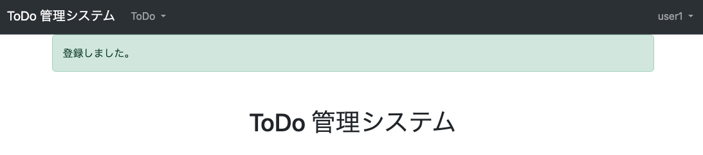

#  ユーザー機能 ToDo 登録
* やること
  1. `tutorial/todo/forms.py` に ToDo 登録フォームを追加
  2. `tutorial/todo/views.py` に ToDo 登録機能を追加
  3. `tutorial/todo/templates/todo/create.html` に ToDo 登録画面を作成
     * [bootstrap-datepicker](https://bootstrap-datepicker.readthedocs.io/en/latest/index.html) を使って日付入力のデザインを調整
     * URL は [こちら](https://cdnjs.com/libraries/bootstrap-datepicker) から取得
  4. `tutorial/todo/urls.py` に view を追加
  5. `tutorial/templates/base.html` にリンクを追加


### tutorial/todo/forms.py 変更
```python
...
from .models import ToDoUser, ToDo, Category  # 変更

...

class ToDoCreateForm(forms.ModelForm, FormControlMixin):  # 以下追加

    class Meta:
        model = ToDo
        fields = [
            "name",
            "deadline",
            "priority",
            "categories",
            "note",
        ]
        widgets = {
            'categories': forms.CheckboxSelectMultiple()
        }

    def __init__(self, *args, **kwargs):
        self.request = kwargs.pop("request")
        super().__init__(*args, **kwargs)
        self.fields['categories'].queryset = Category.objects.filter(enabled=True)
        self.fields['categories'].widget.attrs.update({'class': "checkbox"})

    def save(self, commit=True):
        todo = super().save(commit=False)
        todo.user = self.request.user.todouser
        if commit:
            todo.save()
            self.save_m2m()
        return todo
```

### tutorial/todo/views.py 変更
```python
from tutorial.views import LoginRequiredMixin  # 追加
from .models import ToDoUser, ToDo  # 変更
from .forms import ToDoUserCreateForm, ToDoCreateForm  # 変更

...

class ToDoCreateView(LoginRequiredMixin, SuccessMessageMixin, CreateView):  # 以下追加
    model = ToDo
    form_class = ToDoCreateForm
    success_url = reverse_lazy('index')
    template_name = "todo/create.html"
    success_message = "登録しました。"

    def get_form_kwargs(self):
        kwargs = super().get_form_kwargs()
        kwargs.update({"request": self.request})
        return kwargs
```


### tutorial/todo/templates/todo/create.html 作成
```html

ToDo 登録


<link rel="stylesheet" href="https://cdnjs.cloudflare.com/ajax/libs/bootstrap-datepicker/1.10.0/css/bootstrap-datepicker.min.css" integrity="sha512-34s5cpvaNG3BknEWSuOncX28vz97bRI59UnVtEEpFX536A7BtZSJHsDyFoCl8S7Dt2TPzcrCEoHBGeM4SUBDBw==" crossorigin="anonymous" referrerpolicy="no-referrer" />



<script src="https://cdnjs.cloudflare.com/ajax/libs/bootstrap-datepicker/1.10.0/js/bootstrap-datepicker.min.js" integrity="sha512-LsnSViqQyaXpD4mBBdRYeP6sRwJiJveh2ZIbW41EBrNmKxgr/LFZIiWT6yr+nycvhvauz8c2nYMhrP80YhG7Cw==" crossorigin="anonymous" referrerpolicy="no-referrer"></script>
<script src="https://cdnjs.cloudflare.com/ajax/libs/bootstrap-datepicker/1.10.0/locales/bootstrap-datepicker.ja.min.js" integrity="sha512-zI0UB5DgB1Bvvrob7MyykjmbEI4e6Qkf5Aq+VJow4nwRZrL2hYKGqRf6zgH3oBQUpxPLcF2IH5PlKrW6O3y3Qw==" crossorigin="anonymous" referrerpolicy="no-referrer"></script>
<script type="text/javascript">
  $(function(){
      $('#id_deadline').datepicker({
        format: 'yyyy-mm-dd',
        language: 'ja',
      });
  });
</script>







```


### tutorial/todo/urls.py 変更
```python
from django.urls import path
from .views import ToDoUserCreateView, ToDoCreateView  # 変更

urlpatterns = [
    path("create/", ToDoCreateView.as_view(), name="create"),  # 追加
    path("user/create/", ToDoUserCreateView.as_view(), name="user_create"),
]
```

### tutorial/templates/base.html 変更
```html
                
                  
                    <li class="nav-item dropdown">
                      <a class="nav-link dropdown-toggle" href="#" id="navbarDropdownCategory" role="button" data-bs-toggle="dropdown" aria-expanded="false">
                        カテゴリー
                      </a>
                      <ul class="dropdown-menu", aria-labelledby="navbarDropdownCategory">
                        <li><a class="dropdown-item" href="">一覧</a></li>
                        <li><a class="dropdown-item" href="">登録</a></li>
                      </ul>
                    </li>
                   <!-- 追加ここから -->
                    <li class="nav-item dropdown">
                      <a class="nav-link dropdown-toggle" href="#" id="navbarDropdownTodo" role="button" data-bs-toggle="dropdown" aria-expanded="false">
                        ToDo
                      </a>
                      <ul class="dropdown-menu", aria-labelledby="navbarDropdownTodo">
                        <li><a class="dropdown-item" href="">登録</a></li>
                      </ul>
                    </li> <!-- 追加ここまで -->
                  
                
```


### 確認
[http://127.0.0.1:8000/todo/create/](http://127.0.0.1:8000/todo/create/) にアクセスして、以下となっていれば OK。

#### ToDo 登録画面



#### 登録完了画面 (トップページ)



