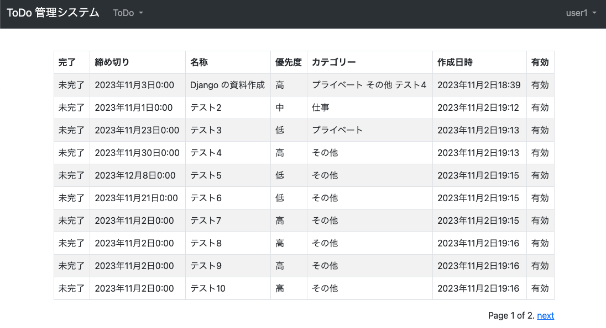

#  ユーザー機能 ToDo 一覧
* やること
  1. `tutorial/todo/views.py` に ToDo 一覧機能を追加
  2. `tutorial/todo/templates/todo/list.html` に ToDo 一覧画面を作成
  3. `tutorial/todo/models.py` にカテゴリ表示用処理追加
  3. `tutorial/todo/urls.py` に view を追加
  4. `tutorial/templates/base.html` にリンクを追加


### tutorial/todo/views.py 変更
```python
from django.views.generic import CreateView, ListView  # 変更
from django.contrib.messages.views import SuccessMessageMixin
from django.urls import reverse_lazy

...

class ToDoCreateView(LoginRequiredMixin, SuccessMessageMixin, CreateView):
    model = ToDo
    form_class = ToDoCreateForm
    success_url = reverse_lazy('todo:list')  # 変更
    template_name = "todo/create.html"
    success_message = "登録しました。"

    def get_form_kwargs(self):
        kwargs = super().get_form_kwargs()
        kwargs.update({"request": self.request})
        return kwargs


class ToDoListView(LoginRequiredMixin, ListView):  # 以下追加
    model = ToDo
    template_name = "todo/list.html"
    context_object_name = "todo_list"
    paginate_by = 10

    def get_queryset(self):
        queryset = super().get_queryset()
        queryset = queryset.filter(user__id=self.request.user.id)
        return queryset
```


### tutorial/todo/templates/todo/list.html 作成
```html

ToDo 一覧


<table class="table table-bordered table-striped">
  <thead>
    <tr>
      <th>完了</th><th>締め切り</th><th>名称</th><th>優先度</th><th>カテゴリー</th><th>作成日時</th><th>有効</th>
    </tr>
  </thead>
  <tbody>
    
    <tr>
      <td>{{ todo.completed }}未完了</td>
      <td>{{ todo.deadline }}</td>
      <td>{{ todo.name }}</td>
      <td>{{ todo.get_priority_display }}
      <td>{{ todo.get_categories_display }}</td>
      <td>{{ todo.created }}</td>
      <td>有効無効</td>
    </tr>
    
  </tbody>
</table>




```

### tutorial/todo/models.py 変更
```python
class ToDo(ModelBase):
...
    def get_categories_display(self):
        return " ".join([c.name for c in self.categories.all()])
```


### tutorial/todo/urls.py 変更
```python
from django.urls import path
from .views import ToDoUserCreateView, ToDoCreateView, ToDoListView  # 変更

urlpatterns = [
    path("", ToDoListView.as_view(), name="list"),  # 追加
    path("create/", ToDoCreateView.as_view(), name="create"),
    path("user/create/", ToDoUserCreateView.as_view(), name="user_create"),
]
```

### tutorial/templates/base.html 変更
```html
                  
                    <li class="nav-item dropdown">
                      <a class="nav-link dropdown-toggle" href="#" id="navbarDropdownTodo" role="button" data-bs-toggle="dropdown" aria-expanded="false">
                        ToDo
                      </a>
                      <ul class="dropdown-menu", aria-labelledby="navbarDropdownTodo">
                        <li><a class="dropdown-item" href="">一覧</a></li> <!-- 追加 -->
                        <li><a class="dropdown-item" href="">登録</a></li>
                      </ul>
                    </li>
                  
                
```


### 確認
[http://127.0.0.1:8000/todo/create/](http://127.0.0.1:8000/todo/create/) にアクセスして、以下となっていれば OK。

#### ToDo 一覧画面



