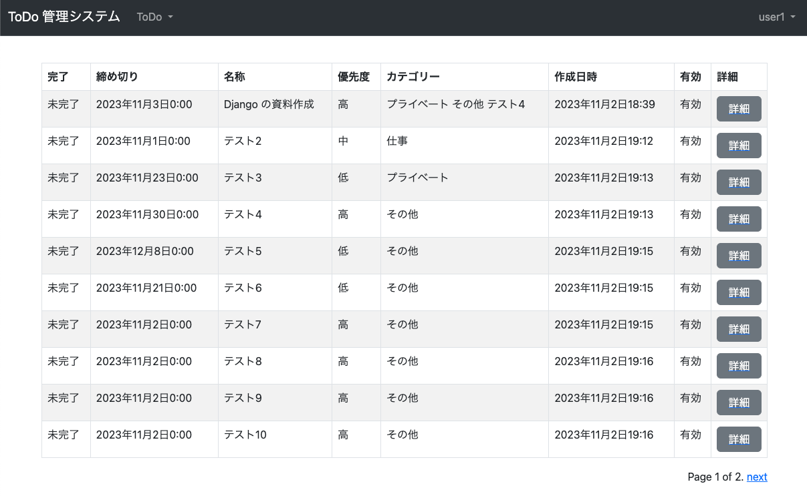
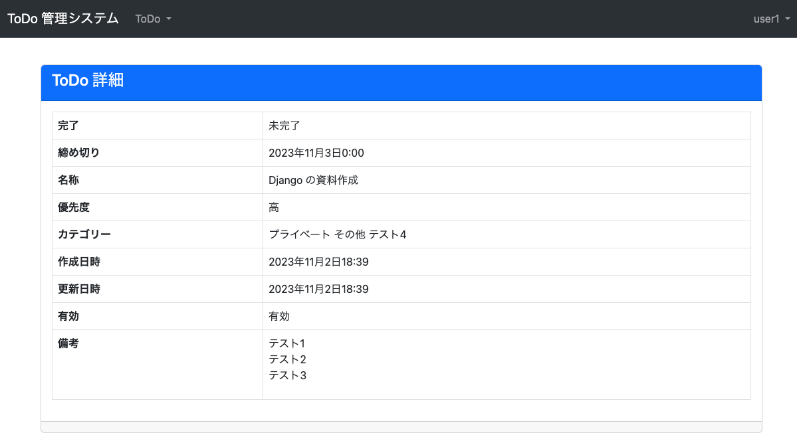

#  ユーザー機能 ToDo 詳細
* やること
  1. `tutorial/todo/views.py` に ToDo 詳細機能を追加
  2. `tutorial/todo/templates/todo/detail.html ` に ToDo 詳細画面を作成
  3. `tutorial/todo/urls.py` に view を追加
  4. `tutorial/todo/templates/todo/list.html` にリンクを追加


### tutorial/todo/views.py 変更
```python
from django.views.generic import CreateView, ListView, DetailView  # 変更

...

class ToDoDetailView(LoginRequiredMixin, DetailView):  # 以下追加
    model = ToDo
    pk_url_kwarg = "todo_id"
    template_name = "todo/detail.html"
```


### tutorial/todo/templates/todo/detail.html 作成
```html

ToDo 詳細


<div class="card">
  <div class="card-header text-bg-primary">
    <h4 class="card-title">ToDo 詳細</h4>
  </div>
  <div class="card-body">
    <table class="table table-bordered">
      <tr>
        <th>完了</th>
        <td>{{ todo.completed }}未完了</td>
      </tr>
      <tr>
        <th>締め切り</th>
        <td>{{ todo.deadline }}</td>
      </tr>
      <tr>
        <th>名称</th>
        <td>{{ todo.name }}</td>
      </tr>
      <tr>
        <th>優先度</th>
        <td>{{ todo.get_priority_display }}</td>
      </tr>
      <tr>
        <th>カテゴリー</th>
        <td>{{ todo.get_categories_display }}</td>
      </tr>
      <tr>
        <th>作成日時</th>
        <td>{{ todo.created }}</td>
      </tr>
      <tr>
        <th>更新日時</th>
        <td>{{ todo.updated }}</td>
      </tr>
      <tr>
        <th>有効</th>
        <td>有効無効</td>
      </tr>
      <tr>
        <th>備考</th>
        <td>{{ todo.note|linebreaks }}</td>
      </tr>
    </table>
  </div>
  <div class="card-footer align-center">
  </div>
</div>

```


### tutorial/todo/urls.py 変更
```python
from django.urls import path
from .views import ToDoUserCreateView, ToDoCreateView, ToDoListView, ToDoDetailView  # 変更

urlpatterns = [
    path("", ToDoListView.as_view(), name="list"),
    path("<int:todo_id>/", ToDoDetailView.as_view(), name="detail"),  # 追加
    path("create/", ToDoCreateView.as_view(), name="create"),
    path("user/create/", ToDoUserCreateView.as_view(), name="user_create"),
]
```

### tutorial/todo/templates/todo/list.html 変更
```html

ToDo 一覧


<table class="table table-bordered table-striped">
  <thead>
    <tr>
      <th>完了</th><th>締め切り</th><th>名称</th><th>優先度</th><th>カテゴリー</th><th>作成日時</th><th>有効</th><th>詳細</th>  <!-- 変更 -->
    </tr>
  </thead>
  <tbody>
    
    <tr>
      <td>{{ todo.completed }}未完了</td>
      <td>{{ todo.deadline }}</td>
      <td>{{ todo.name }}</td>
      <td>{{ todo.get_priority_display }}
      <td>{{ todo.get_categories_display }}</td>
      <td>{{ todo.created }}</td>
      <td>有効無効</td>
      <td> <!-- 追加ここから -->
        <a href="" class="d-grid">
          <button class="btn btn-secondary" type="button">詳細</button>
        </a>
      </td> <!-- 追加ここまで -->
    </tr>
    
  </tbody>
</table>




```


### 確認
[http://127.0.0.1:8000/todo/](http://127.0.0.1:8000/todo/) にアクセスして、以下となっていれば OK。

#### ToDo 一覧画面



#### ToDo 詳細画面



