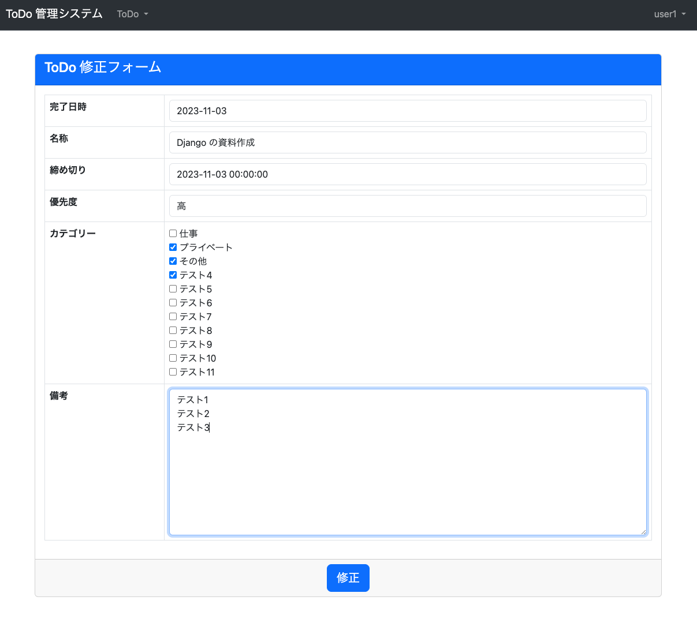
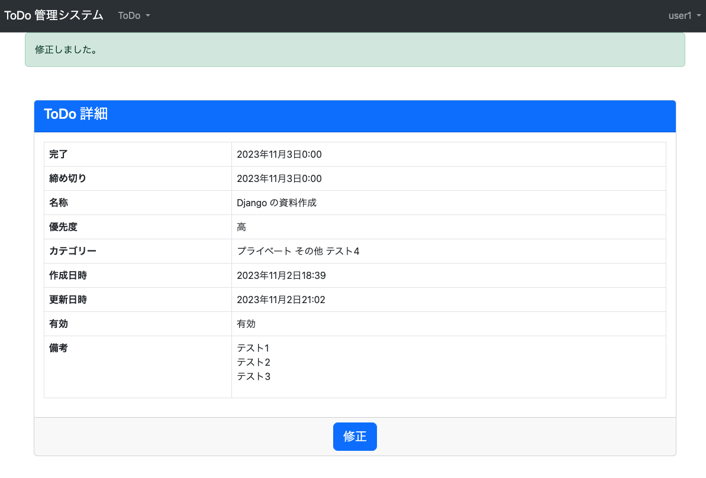

#  ユーザー機能 ToDo 修正
* やること
  1. `tutorial/todo/forms.py` に ToDo 修正フォームを追加
  1. `tutorial/todo/views.py` に ToDo 修正機能を追加
  2. `tutorial/todo/templates/todo/edit.html ` に ToDo 修正画面を作成
  3. `tutorial/todo/urls.py` に view を追加
  2. `tutorial/todo/templates/todo/detail.html ` にリンクを追加

### tutorial/todo/forms.py 変更
```python

class ToDoEditForm(forms.ModelForm, FormControlMixin):  # 以下追加

    class Meta:
        model = ToDo
        fields = [
            "completed",
            "name",
            "deadline",
            "priority",
            "categories",
            "note",
        ]
        widgets = {
            'categories': forms.CheckboxSelectMultiple()
        }

    def __init__(self, *args, **kwargs):
        super().__init__(*args, **kwargs)
        self.fields['categories'].queryset = Category.objects.filter(enabled=True)
        self.fields['categories'].widget.attrs.update({'class': "checkbox"})
```

### tutorial/todo/views.py 変更
```python
from django.views.generic import CreateView, ListView, DetailView, UpdateView  # 変更
from django.contrib.messages.views import SuccessMessageMixin
from django.urls import reverse_lazy

from tutorial.views import LoginRequiredMixin
from .models import ToDoUser, ToDo
from .forms import ToDoUserCreateForm, ToDoCreateForm, ToDoEditForm  # 変更

...

class ToDoEditView(LoginRequiredMixin, SuccessMessageMixin, UpdateView):
    model = ToDo
    form_class = ToDoEditForm
    pk_url_kwarg = "todo_id"
    template_name = "todo/edit.html"
    success_message = "修正しました。"

    def get_success_url(self):
        return reverse_lazy('todo:detail', args=(self.object.id,))
```


### tutorial/todo/templates/todo/edit.html 作成
```html

ToDo 修正


<link rel="stylesheet" href="https://cdnjs.cloudflare.com/ajax/libs/bootstrap-datepicker/1.10.0/css/bootstrap-datepicker.min.css" integrity="sha512-34s5cpvaNG3BknEWSuOncX28vz97bRI59UnVtEEpFX536A7BtZSJHsDyFoCl8S7Dt2TPzcrCEoHBGeM4SUBDBw==" crossorigin="anonymous" referrerpolicy="no-referrer" />



<script src="https://cdnjs.cloudflare.com/ajax/libs/bootstrap-datepicker/1.10.0/js/bootstrap-datepicker.min.js" integrity="sha512-LsnSViqQyaXpD4mBBdRYeP6sRwJiJveh2ZIbW41EBrNmKxgr/LFZIiWT6yr+nycvhvauz8c2nYMhrP80YhG7Cw==" crossorigin="anonymous" referrerpolicy="no-referrer"></script>
<script src="https://cdnjs.cloudflare.com/ajax/libs/bootstrap-datepicker/1.10.0/locales/bootstrap-datepicker.ja.min.js" integrity="sha512-zI0UB5DgB1Bvvrob7MyykjmbEI4e6Qkf5Aq+VJow4nwRZrL2hYKGqRf6zgH3oBQUpxPLcF2IH5PlKrW6O3y3Qw==" crossorigin="anonymous" referrerpolicy="no-referrer"></script>
<script type="text/javascript">
  $(function(){
      $('#id_completed').datepicker({
        format: 'yyyy-mm-dd',
        language: 'ja',
      });
      $('#id_deadline').datepicker({
        format: 'yyyy-mm-dd',
        language: 'ja',
      });
  });
</script>






```


### tutorial/todo/urls.py 変更
```python
from django.urls import path
from .views import ToDoUserCreateView, ToDoCreateView, ToDoListView, ToDoDetailView, ToDoEditView  # 変更

urlpatterns = [
    path("", ToDoListView.as_view(), name="list"),
    path("<int:todo_id>/", ToDoDetailView.as_view(), name="detail"),
    path("<int:todo_id>/edit/", ToDoEditView.as_view(), name="edit"),  # 追加
    path("create/", ToDoCreateView.as_view(), name="create"),
    path("user/create/", ToDoUserCreateView.as_view(), name="user_create"),
]
```

### tutorial/todo/templates/todo/detail.html 変更っ
```html
  <div class="card-footer align-center">
    <a href=""> <!-- 追加ここから -->
      <button type="button" class="btn btn-lg btn-primary">修正</button>
    </a> <!-- 追加ここまで -->
  </div>
</div>

```


### 確認
[http://127.0.0.1:8000/todo/1/edit/](http://127.0.0.1:8000/todo/1/edit/) にアクセスして、以下となっていれば OK。

#### ToDo 修正画面



#### 修正完了画面 (ToDo 詳細画面)



